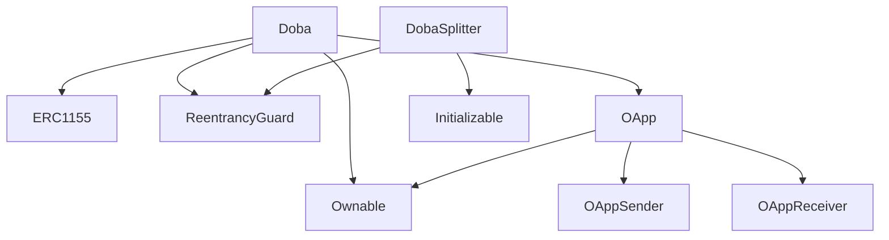

# Doba Protocol

Here's your guide to all available resources.

**Project:** Doba Protocol
**Status:** Mainnet
**Version:** 1.0.0

## Inheritance Graph



## Get Started

**New to this project?** Start here:

1. **[QUICK_START.md](./QUICK_START.md)**
   - 5-minute setup guide
   - Installation steps
   - First time running the app
   - Troubleshooting

2. **[README.md](./README.md)**
   - Project overview
   - Features & technologies
   - Quick reference
   - Deployment options

## Design & Styling

Understand the visual design and styling system:

1. **[DESIGN_SYSTEM.md](./DESIGN_SYSTEM.md)**
   - Color palette (Midnight, Cyber Pink, Lavender)
   - Typography (Neue Machina + IBM Plex Mono)
   - Component styling
   - Accessibility guidelines
   - CSS implementation
   - Quick reference table

2. **[FONT_SETUP.md](./FONT_SETUP.md)**
   - Adding Neue Machina fonts
   - Font weights & files
   - Fallback options
   - Troubleshooting font issues

## Development

Learn how to use and customize components:

1. **[COMPONENT_USAGE.md](./COMPONENT_USAGE.md)**
   - SongCard component
   - MarketplaceGrid component
   - MyStudioGrid component
   - ConnectHeader component
   - Layout patterns
   - Styling patterns
   - Integration examples
   - Testing examples

2. **[WEB3_IMPLEMENTATION_GUIDE.md](./WEB3_IMPLEMENTATION_GUIDE.md)**
   - Smart contract setup
   - Contract integration
   - Wagmi setup
   - Event listeners
   - Web3 functions
   - Future integration checklist

## Project Info

Get insights about the project structure and build:

1. **[BUILD_SUMMARY.md](./BUILD_SUMMARY.md)**
   - What was built
   - Component status
   - File structure
   - Feature checklist
   - Customization guide
   - Deployment notes

---

## Documentation Map

### By Use Case

**"I want to..."**

| Goal | Document | Section |
|------|----------|---------|
| Run the app locally | QUICK_START.md | Installation |
| Understand the design | DESIGN_SYSTEM.md | All sections |
| Understand the font system | FONT_SETUP.md | All sections |
| Use a component | COMPONENT_USAGE.md | Component guides |
| Connect to blockchain | WEB3_IMPLEMENTATION_GUIDE.md | All sections |
| Deploy to production | QUICK_START.md | Building for Production |
| Customize colors | DESIGN_SYSTEM.md | CSS Implementation |
| See project summary | BUILD_SUMMARY.md | All sections |

### By Document

| Document | Purpose | Read Time | Level |
|----------|---------|-----------|-------|
| QUICK_START.md | Setup & run | 5 min | Beginner |
| README.md | Overview | 5 min | Beginner |
| DESIGN_SYSTEM.md | Colors & styling | 10 min | Beginner |
| FONT_SETUP.md | Font installation | 5 min | Beginner |
| COMPONENT_USAGE.md | How to use components | 15 min | Intermediate |
| WEB3_IMPLEMENTATION_GUIDE.md | Blockchain integration | 20 min | Advanced |
| BUILD_SUMMARY.md | Project details | 10 min | Intermediate |

---

## 🎯 Quick Navigation

### For Designers

- Start with [DESIGN_SYSTEM.md](./DESIGN_SYSTEM.md)
- Reference: Color palette, typography, components
- Visual guidelines & specifications

### For Developers

- Start with [QUICK_START.md](./QUICK_START.md)
- Then read [COMPONENT_USAGE.md](./COMPONENT_USAGE.md)
- Reference: How components work, how to customize

### For Web3 Engineers

- Start with [WEB3_IMPLEMENTATION_GUIDE.md](./WEB3_IMPLEMENTATION_GUIDE.md)
- Reference: Smart contract integration, Wagmi setup
- See [lib/web3.ts](./lib/web3.ts) for constants

### For DevOps/Deployment

- See [README.md](./README.md#-deployment)
- Reference: Building, deployment options, env vars

---

## 📁 Project Structure

```
Documentation/
├── README.md                          ⭐ Start here
├── QUICK_START.md                    📖 Setup guide
├── DESIGN_SYSTEM.md                  🎨 Design reference
├── FONT_SETUP.md                     📝 Font guide
├── COMPONENT_USAGE.md                🔧 Component guide
├── WEB3_IMPLEMENTATION_GUIDE.md       🔗 Web3 guide
├── BUILD_SUMMARY.md                  📋 Build info
├── DOCUMENTATION_INDEX.md             📚 This file
│
Code/
├── app/
│   ├── page.tsx                      📄 Main doba dashboard
│   ├── layout.tsx                    ⚙️ Font config
│   └── globals.css                   🎨 Design tokens
│
├── components/
│   ├── SongCard.tsx                  🎵 NFT card
│   ├── MarketplaceGrid.tsx           📊 Song grid
│   ├── MyStudioGrid.tsx              👤 User NFTs
│   ├── ConnectHeader.tsx             🔐 Wallet UI
│   └── ui/                           🎛️ shadcn/ui
│
└── lib/
    ├── web3.ts                       🔗 Web3 config
    └── utils.ts                      🛠️ Utilities
```

---

## 🔍 Key Files Reference

### Essential Files

| File | Purpose | Key Content |
|------|---------|-------------|
| `app/page.tsx` | Main dashboard | doba layout, tabs, navigation |
| `app/layout.tsx` | Root layout | Font setup, metadata |
| `app/globals.css` | Global styles | Design tokens, color system |
| `tailwind.config.ts` | Tailwind config | Colors, fonts, utilities |
| `lib/web3.ts` | Web3 config | Contract ABI, constants |

### Component Files

| File | Purpose | Props |
|------|---------|-------|
| `components/SongCard.tsx` | NFT card | id, title, creator, price, cover, collaborators |
| `components/MarketplaceGrid.tsx` | Song grid | songs, isConnected |
| `components/MyStudioGrid.tsx` | User NFTs | nfts |
| `components/ConnectHeader.tsx` | Wallet | isConnected, onConnect |

### Documentation Files

| File | Topics |
|------|--------|
| README.md | Overview, features, stack |
| QUICK_START.md | Installation, running locally |
| DESIGN_SYSTEM.md | Colors, typography, components |
| FONT_SETUP.md | Font installation & troubleshooting |
| COMPONENT_USAGE.md | Component props, examples, patterns |
| WEB3_IMPLEMENTATION_GUIDE.md | Smart contracts, Wagmi, integration |
| BUILD_SUMMARY.md | Project structure, feature status |

---

## Learning Path

### Beginner (5 min)

1. Read [QUICK_START.md](./QUICK_START.md)
2. Run `bun run dev`
3. Explore doba

### Intermediate (30 min)

1. Review [DESIGN_SYSTEM.md](./DESIGN_SYSTEM.md)
2. Read [COMPONENT_USAGE.md](./COMPONENT_USAGE.md)
3. Customize colors/fonts

### Advanced (1-2 hours)

1. Study [WEB3_IMPLEMENTATION_GUIDE.md](./WEB3_IMPLEMENTATION_GUIDE.md)
2. Install Wagmi packages
3. Connect to smart contract

---

## Common Tasks

### "How do I...?"

#### Run the project?

→ [QUICK_START.md](./QUICK_START.md) - Installation section (use `bun install`)

#### Add Neue Machina fonts?

→ [FONT_SETUP.md](./FONT_SETUP.md) - Font Setup section

#### Change the colors?

→ [DESIGN_SYSTEM.md](./DESIGN_SYSTEM.md) - CSS Implementation section

#### Use a component?

→ [COMPONENT_USAGE.md](./COMPONENT_USAGE.md) - Component sections

#### Connect to blockchain?

→ [WEB3_IMPLEMENTATION_GUIDE.md](./WEB3_IMPLEMENTATION_GUIDE.md) - Setup & config

#### Deploy to production?

→ [QUICK_START.md](./QUICK_START.md) - Building for Production

#### Understand the project?

→ [BUILD_SUMMARY.md](./BUILD_SUMMARY.md) - All sections

---

## Support & Help

### Issue Troubleshooting

**Fonts not loading?**

- [FONT_SETUP.md](./FONT_SETUP.md) - Troubleshooting section

**App won't start?**

- [QUICK_START.md](./QUICK_START.md) - Troubleshooting section

**Styles look wrong?**

- [DESIGN_SYSTEM.md](./DESIGN_SYSTEM.md) - Implementation section
- [COMPONENT_USAGE.md](./COMPONENT_USAGE.md) - Styling reference

**Components not working?**

- [COMPONENT_USAGE.md](./COMPONENT_USAGE.md) - Component guides

**Web3 integration issues?**

- [WEB3_IMPLEMENTATION_GUIDE.md](./WEB3_IMPLEMENTATION_GUIDE.md) - Full guide

---

## Checklist

Before you start:

- [ ] Read QUICK_START.md
- [ ] Run `bun run dev`
- [ ] Explore doba
- [ ] Check DESIGN_SYSTEM.md for colors
- [ ] Review COMPONENT_USAGE.md for components
- [ ] (Optional) Setup fonts from FONT_SETUP.md
- [ ] (When ready) Follow WEB3_IMPLEMENTATION_GUIDE.md

---

## Next Steps

1. **Explore:** Run the app and test features
2. **Customize:** Update colors, fonts, content
3. **Develop:** Add Web3 integration following guides
4. **Deploy:** Push to Vercel or your hosting
5. **Extend:** Add more features as needed

---

## Document Versions

| Document | Version | Last Updated |
|----------|---------|--------------|
| README.md | 1.0 | Feb 7, 2026 |
| QUICK_START.md | 1.0 | Feb 7, 2026 |
| DESIGN_SYSTEM.md | 1.0 | Feb 7, 2026 |
| FONT_SETUP.md | 1.0 | Feb 7, 2026 |
| COMPONENT_USAGE.md | 1.0 | Feb 7, 2026 |
| WEB3_IMPLEMENTATION_GUIDE.md | 1.0 | Feb 7, 2026 |
| BUILD_SUMMARY.md | 1.0 | Feb 7, 2026 |
| DOCUMENTATION_INDEX.md | 1.0 | Feb 7, 2026 |

---

## 🎵 Happy Building

Everything is ready to go. Start with [QUICK_START.md](./QUICK_START.md) and explore!

**Questions?** Check the relevant documentation file first.

**Ready to code?** Dive into [COMPONENT_USAGE.md](./COMPONENT_USAGE.md)

**Need Web3?** Follow [WEB3_IMPLEMENTATION_GUIDE.md](./WEB3_IMPLEMENTATION_GUIDE.md)

---

   *Created with ❤️ for the doba community*
